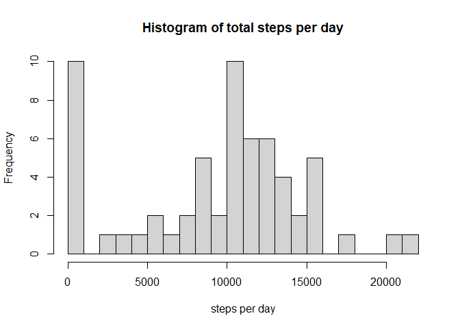

ReadMe
================
ncwBSoh
1/25/2022

### 1. Loading Data

``` r
Data = read.csv("activity.csv")
```

### 2. Histogram of Total Steps

``` r
sumDataDate = aggregate(Data$steps, by = list(Data$date), FUN = sum, na.rm = TRUE)
hist(sumDataDate$x, xlab = "steps per day", main = "Histogram of total steps per day", breaks = 20)
```

<!-- -->

### 3. Median and Mean Total Steps

``` r
median(sumDataDate$x, na.rm = TRUE)
```

    ## [1] 10395

``` r
mean(sumDataDate$x, na.rm = TRUE)
```

    ## [1] 9354.23

### 4. Time-Series Plot of Average Steps by Interval

``` r
meanDataInter = aggregate(Data$steps, by = list(Data$interval), FUN = mean, na.rm = TRUE)
plot(meanDataInter$Group.1, meanDataInter$x, type = "l", xlab = "5-minute Intervals", ylab = "Average number of steps")
```

<!-- -->

### 5. Interval With Maximum Number of Steps on Average

``` r
meanDataInter[which(meanDataInter$x == max(meanDataInter$x)),]$Group.1
```

    ## [1] 835

### 6. Description and Showing Strategy for Imputing Missing Values

Here are the total missing values:

``` r
sum(is.na(Data))
```

    ## [1] 2304

To deal with this, I decide to fill each missing value with the mean for
that 5-minute interval.

``` r
imputeData = Data
#Get the vector of intervals with missing steps
naIntervals = imputeData$interval[is.na(imputeData$steps)]
#Impute the missing values with mean interval value by checking where the intervals are the same
imputeData$steps[is.na(imputeData$steps)] = meanDataInter$x[which(meanDataInter$Group.1 == naIntervals)]
head(imputeData)
```

    ##       steps       date interval
    ## 1 1.7169811 2012-10-01        0
    ## 2 0.3396226 2012-10-01        5
    ## 3 0.1320755 2012-10-01       10
    ## 4 0.1509434 2012-10-01       15
    ## 5 0.0754717 2012-10-01       20
    ## 6 2.0943396 2012-10-01       25
